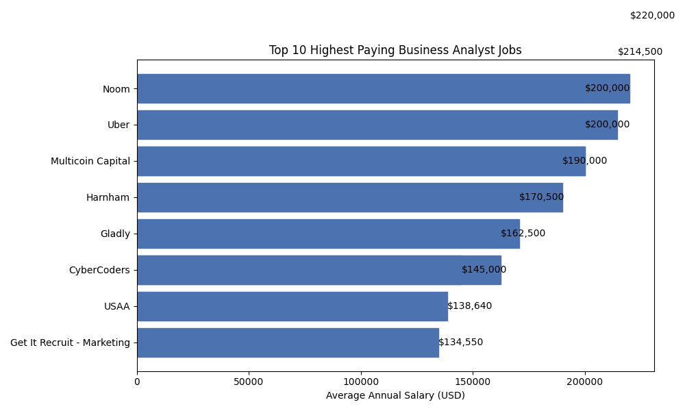
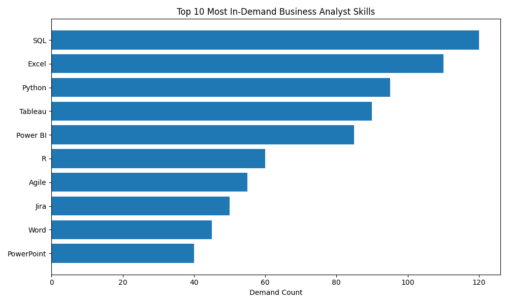
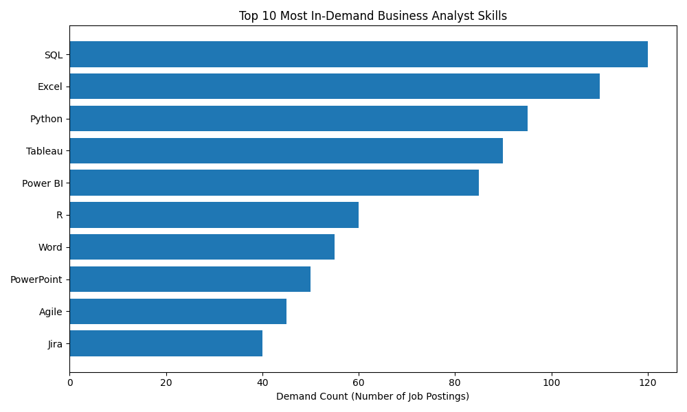

# 📊 SQL Business Analytics Project

## 📌 Introduction

This project analyzes Business Analyst job postings using SQL to identify trends in the job market, with a focus on skill demand, salary distribution, and role requirements. The analysis leverages real-world job posting data to understand how different business and technical skills influence compensation and hiring patterns.

You can explore all SQL queries used in this analysis here:
👉  [[project_sql folder](/Project_sql/)

---

## 🌍 Background

With the increasing demand for Business Analysts in data-driven organizations, it is essential to understand which skills are most required and which are associated with higher salaries. This project uses real job posting data to explore hiring trends, skill requirements, and compensation benchmarks within the Business Analytics domain.
The data hails from real-world job postings and can be accessed here: [Dataset Link](https://drive.google.com/drive/folders/1egWenKd_r3LRpdCf4SsqTeFZ1ZdY3DNx?usp=drive_link) 

### The questions I wanted to answer through my SQL queries were:

1. What are the top-paying Business Analyst jobs?
2. What skills are required for these top-paying jobs?
3. What skills are most in demand for Business Analysts?
4. Which skills are associated with higher salaries?
5. What are the most optimal skills to learn?


---

## 🛠️ Tools I Used

This project was built using SQL for data analysis, PostgreSQL for database management, Excel for basic data exploration and visualization, VS Code as the development environment, and Git & GitHub for version control and project hosting.

- SQL
- PostgreSQL
- Excel
- VS Code
- Git
- GitHub

---

## 📊 The Analysis

This project investigates the Business Analyst role by analyzing real job posting data to uncover trends in salary levels, skill requirements, and market demand.

### 1. Top Paying Business Analyst Roles

I filtered job postings to include only Business Analyst roles, focused on remote opportunities, excluded records with missing salary data, joined the dataset with the company table to retrieve company names, and sorted the results by highest salary to identify the top 10 highest-paying roles.

```sql
SELECT 
    job_title_short,
    job_location,
    salary_year_avg,
    name as company_name
FROM job_postings_fact
LEFT JOIN company_dim ON job_postings_fact.company_id = company_dim.company_id

WHERE
    job_title_short = 'Business Analyst' AND
    job_location = 'Anywhere' AND
    salary_year_avg is NOT NULL
ORDER BY
    salary_year_avg DESC
LIMIT 10

```
---


**Key Insight:**
Top-paying Business Analyst roles are often associated with remote opportunities and companies offering competitive compensation for strong analytical and technical skill sets.

---

### 2.Skill For Top paying Jobs

This analysis identifies which skills are associated with higher average salaries by joining job postings with required skills and aggregating salary data.

```sql
SELECT 
    skills ,
    ROUND(AVG(salary_year_avg), 0) AS avg_salary
FROM job_postings_fact

INNER JOIN skills_job_dim ON job_postings_fact.job_id = skills_job_dim.job_id
INNER JOIN skills_dim ON skills_job_dim.skill_id = skills_dim.skill_id
WHERE
    job_title_short = 'Business Analyst' AND
    salary_year_avg IS NOT NULL 
GROUP BY
    skills
ORDER BY
    avg_salary DESC
LIMIT 10;
```
**Key Insight:**
Technical tools such as SQL, Python, and BI tools tend to be associated with higher salary ranges.

---
### 3.Top Demanted Skill
Most Frequently Required Skills in Business Analyst Job Postings

```sql

SELECT 
    skills ,
    count(skills_job_dim.job_id) AS demand_count
FROM job_postings_fact

INNER JOIN skills_job_dim ON job_postings_fact.job_id = skills_job_dim.job_id
INNER JOIN skills_dim ON skills_job_dim.skill_id = skills_dim.skill_id
WHERE
    job_title_short = 'Business Analyst'
GROUP BY
    skills
ORDER BY
    demand_count DESC
LIMIT 10
```


Business Analyst job postings are dominated by data querying and spreadsheet tools, with growing emphasis on visualization platforms and technical workflow skills, signaling a shift toward more data-centric responsibilities.


---

### 4. Top Paying Skill

This section combines demand frequency and salary averages to identify the most valuable skills in the market.

```sql
SELECT 
    skills ,
    ROUND(AVG(salary_year_avg), 0) AS avg_salary
FROM job_postings_fact

INNER JOIN skills_job_dim ON job_postings_fact.job_id = skills_job_dim.job_id
INNER JOIN skills_dim ON skills_job_dim.skill_id = skills_dim.skill_id
WHERE
    job_title_short = 'Business Analyst' AND
    salary_year_avg IS NOT NULL 
GROUP BY
    skills
ORDER BY
    avg_salary DESC
LIMIT 25
```



The demand distribution shows that Business Analyst roles are largely centered on SQL, Excel, and BI tools. In addition, programming and data visualization skills are increasingly required, highlighting the evolving technical nature of the role.

---
### 5. In Demand Skill For Business Analyst
This analysis highlights the most in-demand skills for Business Analyst roles while also incorporating average salary data, providing a combined view of both market demand and earning potential for each skill.
```sql
SELECT
    skills_demand.skill_id,
    skills_demand.skills,
    skills_demand.demand_count,
    average_salary.avg_salary
FROM skills_demand
INNER JOIN average_salary ON skills_demand.skill_id = average_salary.skill_id
WHERE
    skills_demand.demand_count > 5
ORDER BY
    average_salary.avg_salary DESC,
    skills_demand.demand_count DESC
LIMIT 25
```
👇

📊 In-Demand Skills with Salary Insights (Business Analyst)

| Skill      | Demand Count | Avg Salary (USD) |
| ---------- | ------------ | ---------------- |
| R          | 8            | $105,969         |
| Python     | 20           | $104,277         |
| SAS        | 7            | $100,308         |
| Tableau    | 27           | $98,794          |
| SQL        | 42           | $95,292          |
| Oracle     | 6            | $93,139          |
| Flow       | 7            | $92,445          |
| Power BI   | 12           | $92,059          |
| Excel      | 31           | $87,212          |
| JavaScript | 7            | $76,212          |

Skills like R, Python, and SAS offer the highest salaries, while SQL, Excel, and Tableau show the strongest demand, making a combination of these skills the most valuable for Business Analysts.

## 📈 Key Techniques Used

* JOINs to combine relational datasets
* CTEs (Common Table Expressions) for s
tructured queries
* Aggregation functions (COUNT, AVG)
* Filtering using WHERE clauses
* Sorting and ranking results using ORDER BY

---

## 📚 What I Learned

* Writing advanced SQL queries for real-world analysis
* Understanding job market patterns through data
* Extracting insights from structured datasets
* Combining multiple tables for analytical reporting

---

## 🏁 Conclusion

This project demonstrates how SQL can be used to analyze Business Analyst job market trends effectively. The findings highlight that skills such as SQL, Python, and business intelligence tools are strongly associated with both high demand and higher salary potential, making them essential for career growth in the analytics domain.
